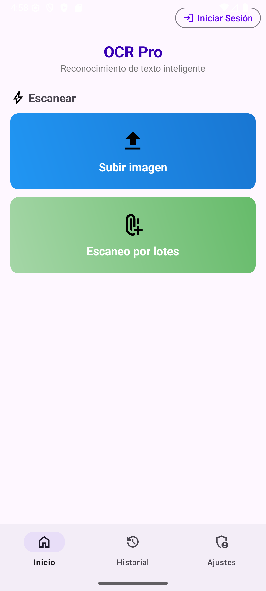
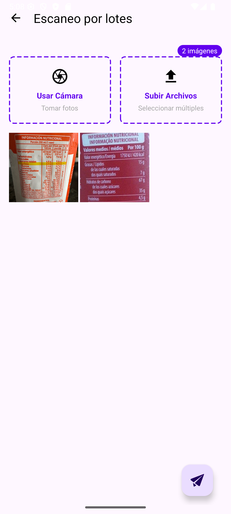
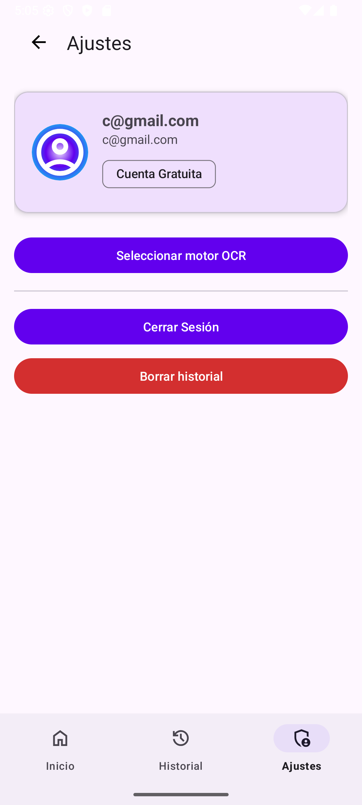

# OCR Mobile – Cliente Android
> Aplicación Android que escanea imágenes (o lotes), extrae texto con **EasyOCR** o **Google Vision** y gestiona un historial personal protegido con JWT.  

---

## Índice
1. [Demo & capturas](#demo--capturas)  
2. [Características](#características)   
3. [Ejecución y pruebas](#ejecución-y-pruebas)  
4. [Seguridad](#seguridad)  

---

## Demo & capturas

| Pantalla                | Imagen                                                        |
|-------------------------|---------------------------------------------------------------|
| Pantalla principal      |  |
| Selección de imágenes   |  |
| Historial               |  |
| Ajustes                 |  |

---

## Características
* **Registro / login** con backend **FastAPI**  
* **JWT** persistido y añadido por `AuthInterceptor`  
* Motores OCR:
  * **EasyOCR** (gratuito, por defecto)  
  * **Google Vision** (requiere cuenta Premium)  
* Subida **individual** o **por lotes** (≤ 10 imágenes) con barra de progreso  
* Historial con:
  * Agrupación por fecha y cabeceras sticky  
  * Filtro por día 
  * Copiar al portapapeles y vista ampliada (doble-tap)  
  * Borrado individual o completo  
* **Stripe PaymentSheet** para compra in-app  
* Preferencias locales (motor OCR)    

## Ejecución y pruebas rápidas

| Acción                                       | Endpoint (backend)             |
|----------------------------------------------|--------------------------------|
| Registro                                     | `POST /register`               |
| Login → guarda JWT                           | `POST /login`                  |
| OCR (EasyOCR)                                | `POST /ocr`                    |
| OCR (Google Vision, cuenta Premium)          | `POST /ocr_google`             |
| Historial                                    | `GET /history`                 |
| Borrar entrada                               | `DELETE /history/{id}`         |
| Crear PaymentIntent                          | `POST /create-payment-intent`  |
| Confirmar upgrade                            | `POST /upgrade`                |

> Un **401/403** provoca cierre de sesión automático.

---

## Seguridad

El JWT incluye los siguientes _claims_:

| Claim         | Descripción                        |
|---------------|------------------------------------|
| `sub`         | Email del usuario                  |
| `is_premium`  | `true` si la cuenta es Premium     |
| `exp`         | Fecha de expiración (24 horas)     |

## Roadmap

- [ ] Reforzar la seguridad
- [ ] Permitir modo completamente offline
- [ ] Añadir post-procesado semántico 
- [ ] Ofrecer opciones de exportación

